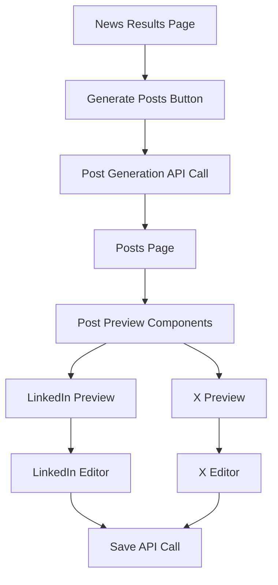

# Sprint 3 Frontend Implementation Plan: LinkedIn & X Post Generation

## 🎯 Overview

This document outlines the frontend implementation plan for Sprint 3, which focuses on creating the user interface for generating, previewing, and editing LinkedIn and X (Twitter) posts from news articles.

## 🏗️ Architecture Overview



## 📋 Implementation Tasks

### 1. **Update NewsResults Component**

**File**: `frontend/src/components/NewsResults.tsx`

**Tasks**:
- Add a "Generate Posts" button after the news results
- Button should be disabled if no articles are displayed
- On click, navigate to posts page with articles data
- Pass the following data:
  - Selected articles (all displayed articles)
  - Topic
  - News workflow ID
  - Current session ID

**Implementation Details**:
```typescript
// Add button after articles grid
<button 
  onClick={handleGeneratePosts}
  className="btn-primary w-full mt-6"
  disabled={articles.length === 0}
>
  Generate LinkedIn & X Posts
</button>
```

### 2. **Create Posts Page**

**File**: `frontend/src/app/posts/page.tsx`

**Features**:
- Receive articles data from navigation state
- Call post generation API on mount
- Display loading state during generation
- Show generated posts when ready
- Handle errors gracefully

**Page Structure**:
```
Posts Page
├── Header (with back navigation)
├── Loading State (during generation)
├── Error State (if generation fails)
└── Posts Display
    ├── LinkedIn Post Section
    │   ├── Preview Component
    │   └── Edit Button
    └── X Post Section
        ├── Preview Component
        └── Edit Button
```

### 3. **Create Post Preview Components**

#### **LinkedIn Post Preview**
**File**: `frontend/src/components/LinkedInPostPreview.tsx`

**Features**:
- Display formatted LinkedIn post
- Show character count (X/3000)
- Visual indicator for character limit
- Preserve formatting (line breaks, spacing)
- Show hashtags in blue
- Display links with underline

**UI Elements**:
- Card container with LinkedIn-style design
- Character counter with color coding:
  - Green: < 2700 chars
  - Yellow: 2700-2900 chars
  - Red: > 2900 chars
- Edit button in top-right corner

#### **X Post Preview**
**File**: `frontend/src/components/XPostPreview.tsx`

**Features**:
- Display X/Twitter post
- Show character count (X/250)
- Visual indicator for character limit
- Show hashtags in blue
- Display shortened URLs if present

**UI Elements**:
- Card container with X-style design
- Character counter with color coding:
  - Green: < 220 chars
  - Yellow: 220-240 chars
  - Red: > 240 chars
- Edit button in top-right corner

### 4. **Create Post Editor Components**

#### **LinkedIn Post Editor**
**File**: `frontend/src/components/LinkedInPostEditor.tsx`

**Features**:
- Rich text editor (using textarea with formatting support)
- Real-time character counting
- Undo/redo functionality
- Save and Cancel buttons
- Auto-save draft to localStorage

**Implementation**:
```typescript
interface LinkedInPostEditorProps {
  initialContent: string;
  onSave: (content: string) => void;
  onCancel: () => void;
}
```

#### **X Post Editor**
**File**: `frontend/src/components/XPostEditor.tsx`

**Features**:
- Plain text editor
- Real-time character counting
- Character limit enforcement
- Save and Cancel buttons
- Preview of how post will look

### 5. **API Integration**

**File**: `frontend/src/lib/api/posts.ts`

**Functions to implement**:
```typescript
// Generate posts from articles
async function generatePosts(
  articles: NewsArticle[],
  topic: string,
  llmModel: string,
  sessionId: string,
  newsWorkflowId: string
): Promise<PostGenerationResponse>

// Update a post
async function updatePost(
  postId: string,
  content: string
): Promise<GeneratedPost>

// Get posts for session
async function getSessionPosts(
  sessionId: string
): Promise<GeneratedPost[]>

// Delete a post
async function deletePost(
  postId: string
): Promise<void>
```

### 6. **State Management**

**Using React hooks and context**:
- Create `PostsContext` for managing posts state
- Handle loading, error, and success states
- Cache generated posts in context
- Update cache on edit/save

### 7. **Styling and UI Components**

**Tailwind CSS Classes**:
```css
/* Post preview card */
.post-preview-card {
  @apply bg-white rounded-lg shadow-md p-6 border border-gray-200;
}

/* Character counter */
.char-counter {
  @apply text-sm font-medium;
}

.char-counter-safe {
  @apply text-green-600;
}

.char-counter-warning {
  @apply text-yellow-600;
}

.char-counter-danger {
  @apply text-red-600;
}

/* Editor textarea */
.post-editor {
  @apply w-full p-4 border border-gray-300 rounded-lg 
         focus:ring-2 focus:ring-primary-500 focus:border-transparent
         resize-none;
}
```

### 8. **Navigation Updates**

**Update**: `frontend/src/app/layout.tsx`
- Add posts route to navigation if needed
- Update breadcrumbs to include posts page

## 🔄 User Flow

1. User views news results
2. Clicks "Generate Posts" button
3. Navigates to posts page with loading state
4. Posts are generated via API call
5. User sees preview of both posts
6. User can edit either post
7. Editor opens with current content
8. User makes changes with real-time feedback
9. User saves changes
10. Updated post is displayed

## 🧪 Testing Checklist

- [ ] Generate posts button appears only when articles exist
- [ ] Loading state displays during generation
- [ ] Error handling for failed generation
- [ ] LinkedIn preview shows correct formatting
- [ ] X preview shows correct character count
- [ ] Editors enforce character limits
- [ ] Save functionality updates the post
- [ ] Cancel functionality discards changes
- [ ] Character counters update in real-time
- [ ] Navigation works correctly
- [ ] Responsive design on mobile

## 📱 Mobile Considerations

- Stack preview cards vertically on mobile
- Full-screen editors on mobile devices
- Touch-friendly buttons and controls
- Proper keyboard handling for editors

## 🚀 Implementation Order

1. Create API integration functions
2. Create posts page with basic structure
3. Implement post preview components
4. Add generate posts button to NewsResults
5. Implement post editor components
6. Add state management
7. Polish UI and add animations
8. Test all user flows

## 💡 Future Enhancements

- Copy to clipboard functionality
- Direct posting to LinkedIn/X (requires OAuth)
- Post scheduling
- Multiple post variations
- Post templates
- Analytics tracking

This plan provides a complete roadmap for implementing the frontend components needed for Sprint 3's LinkedIn and X post generation feature.
